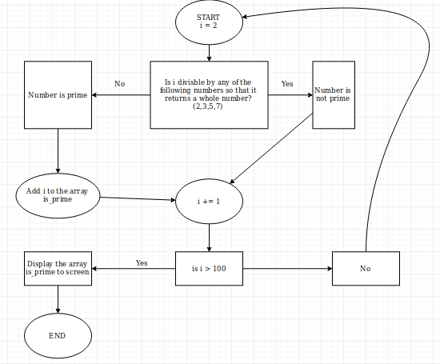

# Jamie Moukatatzakis Workbook Assessment T1A1

## Q1) Research the development of the internet from 1980 to today. You must describe at least FIVE key events in the development of the internet. You can refer to events, people of significance, or technologies and how they have changed over time.
---

1: The initial concept of todays World Wide Web is often credited to Leonard Kleinrock, who in 1961 wrote a paper entilted "Information Flow in Large Communication Nets." In this paper he wrote about ARPANET, the predecessor of the internet.

Although the internet is used for a variety of things today, it's first proper use was to communicate and access information between Universities,as at the time everything had to be sent via mail. 

The term internet was born in 1973 when the University College of England and Royal Radar Establishment(Norway) connected to ARPANET, which was located at MIT in the USA.

2: Transmission Control Protocol (TCP) and Internet Protocol (IP) were established in 1983 as the protocols for ARPANET. These protocols are still the standard protocols for the internet even today.

3: The early stages of the internet were mainly used by Governenment institutions and the academic world. In 1991 however the internet went public. In two years approximately 600 websites are online and the development of the first browser 'Mosaic' begins. By 1995 the 'Browser War' begins with Netscape and Microsoft Internet Explorer battling it out to become the standard web browser for users.

4: In 1996, HoTMaiL was launched. It was the first web based email service. At the time, emails were controlled by your Internet Service Provider (ISP) and so hotmail was advertised as freedom from ISPs. The name hotmail was chosen as it included the letters HTML, the backbone to internet webpages. In one year it had over 8.5 millions subscribers. Hotmail was sold to Microsoft in 1997 and joined Microsofts MSN group of services.

5: Video streaming is considered the main use of the internet today with over 80% of all internet traffic being video related according to Cisco. In the early 2000's video was transferred using a television, VCR cassets and DVDs, so when YouTube was launched in 2005 which provided video on demand it was a huge success. Even till todays, its considered the 2nd biggest website in the world according to user traffic, losing only to google.com.

#### References

https://www.webfx.com/blog/web-design/the-history-of-the-internet-in-a-nutshell/

https://en.wikipedia.org/wiki/Hotmail

https://www.lifewire.com/internet-history-3486216

https://www.livescience.com/20727-internet-history.html

https://history-computer.com/Internet/Maturing/TCPIP.html


## Q2) Define the features of the following technologies that are essential in terms of the development of the internet:
  - packets
  - IP addresses (IPv4 and IPv6)
  - routers and routing
  - domains and DNS

Explain how each technology has contributed to the development of the internet. 

---

Packets : With the expansion of networks and the sheer increase of data being sent, it became a challenge to send messages to their ideal destination in one piece or without error.

Packets allow us to send information with specific network addresses, have basic error detection and break up large sets of data into smaller more managable bits. 

It does this by formating the information we want to send with some basic control measures. The end result of this process is what is refered to as a packet.

<br></br>

IP Addresses : When the basics of the internet were being tested, it was all on a local network. As time went on and more networks and devices were being added it became necessary to be able to identify certain devices.

IPv4 is a unique 32 bit address used to identify a device connected to a network. IPv6 is the newest IP standard and is a 128 bit address instead.

In principle, both IPv4 and IPv6 perform the same function in producing a unique identifier however they differ in how they work. IPv4 is a numeric address seperated by periods ( . ) while IPv6 is an alpha numeric address seperated by colons ( : ).

<br></br>

Routers and Routing: Routers are deviced used in LANs and WANs which serve as connection points(or bridges) from one network to the next. Because the information we require might not always be within our network, we need to venture into other networks to retrieve it. Routers and their routing paths allow us to do this. When we send our packets through a router they contain headers with their destination address. A router, using its routing table, determines a path to that network and forwards our packets in that direction. This is a routing path.

Without Routers, packets would not travel efficiently to their destination and might even end up in limbo or loops.

<br></br>

Domain and DNS: Websites and other services are hosted at IP addresses. With the increase in websites users would have to remember the numeric sequence for all their favorites sites. This ofcourse is impossible so DNS was made. DNS takes this address and translates it into a word or a phrase. This allows web browsers to travel to those websites using those words or phrases rather than just the numerical address. This name or phrase chosen to represent that numerical address is refered to as the Domain.

#### References

https://computer.howstuffworks.com/question525.htm

https://www.cs.uct.ac.za/mit_notes/web_programming/html/ch07s05.html

## Define the features of the following technologies that are essential in terms of the development of the internet:
  - TCP
  - HTTP and HTTPS
  - web browsers (requests, rendering and developer tools)

Explain how each technology has contributed to the development of client and server communication over the internet

---

TCP: TCP stands for Transmission Control Protocol and is one of the main protocols of the internet. It's purpose is to provide ordered, reliable and error checked packets between two devices. Due to this reliability its been a huge part of Internet applications especially those requiring client and server communication. Without it, there would be no reliable way for applications to receive order data and it would be chaos.

<br></br>

HTTP and HTTPS: HTTP or Hyper Text Transfer Protocol is the foundation of communication over the internet. It's the protocol used for viewing and sending information to websites. HTTP however is sent in clear text, making that connection insecure and prone to Man in the Middle attacks. The 's' in HTTPS stands for secure and represents that our connection is encrypted. This allowed for the transfer of more sensitive information between clients and servers such as banking details. 

<br></br>

Web Browsers: A web browser is software used to search and interact with the internet, mainly with websites and web applications. It translates the technical makings of a webpage/application into its intended view for users.

When a user wishes to visit a webpage, your web browser will first send a request via a TCP connection. Once the server responds, it sends the webpage through to your browser and closes the TCP connection. 

The old internet was mostly just text, but in todays modern age many programming languages have been created to style webpages. Web browsers have been developed to be able to translate this new technology using a browser rendering engine. The main languages used today are HTML, CSS and JavaScript. The rendering engine allows the browser to take the initial code of the webpage and render it to the browser the way the user is intended to view it.

Developer tools are added features on browsers that allow web developers to interact with webpages and web applications at a deeper level. It allows them to create, test and debug code/software.

#### References

https://en.wikipedia.org/wiki/Transmission_Control_Protocol

https://developer.mozilla.org/en-US/docs/Glossary/Developer_Tools

## Q4) Identify THREE data structures used in the Ruby programming language and explain the reasons for using each.

Data structures are one of the backbones of all programs/software. They are the way we store and retrieve data.

1) Strings are a data type present in ruby. One of its uses is taking in user input and placing it into a variable. Later on we may manipulate or use this variable for another purpose. Strings are also present in other data structures, such as arrays. It's primary focus however is to represent text rather than numbers.

2) Hashes are a data structure where every value has a key, but the key itself can be anything. This includes other data types such as a string or an integer. Some of its uses include, counting numbers in a string and mappings words to definitions such as phone numbers to people or cities to countries.

3) Arrays are data structures used to store or hold other things, this include other data types such as strings or intergers. They can be used as a base for more advanced data structures, to gather results from a loop or even just for collecting and storing a set of items. Arrays also order items that are stored within them using a zero based index, allowing for acurate data manipulation.

#### References

https://www.rubyguides.com/2019/04/ruby-data-structures/

https://techterms.com/definition/string

http://ruby-for-beginners.rubymonstas.org/built_in_classes/arrays.html


## Q5) Describe the features of interpreters and compilers and how they are different.

In programming, languages are often referred to by a programing level. A high level language is one that is mostly human readable as it consists of words and phrases used in the English language. A computer or machine however cannot understand this, as it runs on binary, meaning one's and zeroes. This is often called machine code. Therefore we must use interpreters or compilers to translate our code into machine code so the computer / machine can understand it.

Some of the features and differences of interpreters and compilers are:

1) An interpreter will translate one line of code at a time while a compiler translates the whole program.
2) An interpreter will stop once an error occurs and display it. This makes debugging easy. A compiler will only show an error if one is present once the whole program has been scanned. There is no way of tracking exactly where the error is, so debugging is harder.
3) An interpreter takes less time to analise our code but the execution time is slower. A compiler is reversed, it takes a long time to analise our code but the execution time is considerably faster.

Ruby and Python are examples of a Interpreter language while C and C# are compiler languages.

#### References

https://www.programiz.com/article/difference-compiler-interpreter


## Q6) Identify TWO commonly used programming languages and explain the benefits and drawbacks of each.

Python: Python is a high level all purpose programming language. It focuses on readability and allowing a programmer to code using fewer steps than other languages. It was developed in 1991 by Guido Van Rossum as he hated the shortcoming of the programming language ABC at the time. He incorporated all the features he thought was good about ABC and then added features he desired.

Some of the advantages of Python include :

* Extensive Support Libraries
Python has a large set of standard libraries that cover many areas of operation. From graphic design to web frameworks and gaming, most highly used programming tasks are already scripted into python allowing programmers to write simpler more efficient code.

* Python is open source
The development of Python is driven by the community which collaborates regularly to develop new modules or libraries as they are needed.

* Presense of Third Party Modules
By using the Python Package Index ( PyPI), pythin is capable of interacting with most other programming languages and platforms.

Some Disadvantages of Python are:

* Weak in Mobile Computing
Python is used mostly as a desktop or server language. There are very few mobile applications built on python.

* Interpreter over Compiler
Python uses an interpreter which causes it's speed to decrease as it has to compile and execute in real time.

* Difficulty learning other languages
Although not primarily a fault of the Python language, it's simplistic yet powerful nature has made programmers so accustomed to its features they struggle to use or learn other programming languages that they may require as a result.

<br></br>

Ruby: Ruby is object oriented language developed by Yukihiro Matsumoto in the mid 1990's. It's purpose was to serve as a buffer between human code and machine code. One of the primary goals was to allow for fast creation of Web Applications as the work required to do so was tedious at the time.

Some advantages of Ruby are:

* Object Oriented
As stated above, being an object oriented language allows for fast and easy development, debugging and maintaining of software. 

* Readability and syntax
Similar to Python, simplicity and readability were part of the main focus allowing programmers to understand and write code in Ruby easily. Ruby has very little syntax compared to other languages.

* Full stack and scalability
Ruby is a full stack framework that covers both front end and back end design. It's also scalable and easy to maintain.

Some disadvantages of Ruby are :

* Decreasing Popularity
Some of the biggest tech companies in the mid 2000's used Ruby as part of their product, Twitter being the biggest. However as time has progressed, Twitter has started to roleback their Ruby components and re code them in other languages. Ruby as a language is slowly losing popularity.

* Hard to Debug
Since everything in Ruby is considered an object, in some cases it can be extremely difficult to debug errors.

* Documentation
In some cases it can be difficult to gather documentation for gems and other libraries. This is especially a concern when dealing with Ruby on Rails, as most of that framework makes heavy use of mixins.

#### References

https://www.quora.com/What-are-the-advantages-and-disadvantages-of-Ruby

https://www.geeksforgeeks.org/comparing-ruby-programming-languages/

https://www.invensis.net/blog/it/benefits-of-python-over-other-programming-languages/

https://medium.com/@mindfiresolutions.usa/advantages-and-disadvantages-of-python-programming-language-fd0b394f2121

https://hackernoon.com/pros-cons-you-must-know-before-using-ruby-on-rails-for-your-startup-234ecd631aaf

## Q7) 

## Q8)Explain control flow, using an example from the Ruby programming language

When we program we often have an idea of how we want the program to run. Often this involves making our program make a decision based on a result. This decision is often called a control flow. The programmer specifies the order in which it wants the computer to behave.

Control flow is represented in code via the use of if loops, while loops, else loops and elsif loops. 

```
puts "Please enter your password"
password = gets.chomp.to_s
if password == qwerty
    puts "Logging in now"
else 
    puts "Login Unsuccessful"
end
```

In the above example, the user is prompted to enter their password. If they enter it correctly they will be logged in, if they enter a false password they will not be logged in. 

Although simplistic, the above example illustrates a simple control flow.

## Q9) Explain type coercion
Type coercion is changing an objects type into another type. For example, changing a string into an interger or vice versa. In Ruby this is achieved using the methods of "to_s" and "to_i" as well as the lesser known methods "to_str" and "to_int".

#### References

https://blog.appsignal.com/2018/09/25/explicitly-casting-vs-implicitly-coercing-types-in-ruby.html

## Q10) Describe the data types recognised by the Ruby programming language. In your description you should give example code which uses each data type, and include the name of the Ruby classes which represent each data type.

Because ruby is a pure Object Oriented Programming language all it's data types are based on classes. The following are the basic data types recognised in Ruby.

1) Numbers (Integers and Floats)

Whole numbers are refered to as Integers. Numbers that have decimal points use the Float data type.

```
distance = 0.1
time = 9.9 / 3600
speed = distance / time

puts "You're average speed for the 100m sprint was {#speed} km/h"
```

2) Boolean

Boolean is a simple data type whose purpose is to display whether something is TRUE or FALSE.

```
1 == 1 #=> true
1 == 2 #=> false
```

3) Strings

Strings are just groups of letters or words enclosed in double quotation marks.

```
string = "Hi " + "There " + "Reader"
puts string
=> Hi There Reader
```

4) Symbols

Symbols are used to represent other objects. It's often refered to as a lightweight string as it will always stay the same size in memory. Once a symbol is created it cannot be modified. It's preceded by a colon (:).

```
"hello".class
=> String

:hello.class
=> Symbol
```

5) Arrays

Arrays store information in an ordered list refered to as an index. It can contain all other data types. Data in an array is enclosed in square brackets ([]) and seperated by commas (,). 

```
num = [1, 2, 3, 4, 5]
puts "There are {#num.size} items in this array"
```

6) Hashes

Hashes are similar to arrays in that they are a collection of other objects however hashes create key-value pairs. Value to a key is assigned by => sign. A key pair is separated with a comma(,) between them and all the pairs are enclosed within curly braces({}).

```
domains = { :au => "Australia", :gr => "Greece",
            :us => "United States", :jp => "Japan" }
puts domains.keys
puts domains.values
```

#### References

http://zetcode.com/lang/rubytutorial/datatypes/

https://www.geeksforgeeks.org/ruby-data-types/

https://www.botreetechnologies.com/blog/ruby-basic-data-types


## Q11) Here’s the problem: “There is a restaurant serving a variety of food. The customers want to be able to buy food of their choice. All the staff just quit, how can you build an app to replace them?”>
  - Identify the classes you would use to solve the problem
  - Write a short explanation of why you would use the classes you have identified

I would create one class called Menu_Items_Ordered

I would assign four attributes to this class including item_no, price, table_no and payment_method.

Upon thinking about this problem one class should suffice as it contains all the components required. The menu item the customers wants, the price of the item, their table number and whether or not they have payed. All of these componenets are required to make the transaction and cover all the information that a staff member would have provided. Methods can be programmed with the above class to create and deliver the meals they ordered. Having one class doesn't over complicate the situation and should allow for easy app development.

## Q12) Identify and explain the error in the following code that is preventing correct execution of the program.
```
celsius = gets
fahrenheit = (celsius * 9 / 5) + 32
print "The result is: "
print fahrenheit
puts "."
```
There are three error that I can see in this code. 
1. No chomp method after the gets command, which doesnt remove the new line character.
2. No conversion of string into a number data type. We primarily want a float for this program however it will execute with an interger as well.
3. Our result will be incorrect in some instances unless we convert celsius variable into a float.

Although the above examples all point out errors, it is the 2nd one that is preventing correct execution of the program. When we use the gets method the user input will always be considered a string unless converted into another data type. Once the program reaches the forward slash in the 2nd line, Ruby has no idea how to proceed and will return the NoMethodError error, as it cannot divide a string.

## Q13) The following code looks for the first two elements that are out of order and swaps them; however, it is not producing the correct results. Rewrite the code so that it works correctly.

```
arr = [5, 22, 29, 39, 19, 51, 78, 96, 84]
i = 0
while (i < arr.size - 1 and arr[i] < arr[i + 1])
  i = i + 1 end
puts i
arr[i] = arr[i + 1]
arr[i + 1] = arr[i]
```

#### My Code
```
arr = [5, 22, 29, 39, 19, 51, 78, 96, 84]
i = 0
while (i < arr.size - 1 and arr[i] < arr[i + 1])
  i = i + 1 end
puts i

arr[i], arr[i + 1] = arr[i + 1], arr[i]
```

## Q14) Demonstrate your algorithmic thinking through completing the following two tasks, in order:
  i. Create a flowchart to outline the steps for listing all prime numbers between 1 and 100 (inclusive). Your flowchart should make use of standard conventions for flowcharts to indicate processes, tasks, actions, or operations  
ii. Write pseudocode for the process outlined in your flowchart



```
- create a empty array named is_prime
- create an interger variable i
- set i = 2
- check if i is divisible by 2,3,5 or 7 so that it is a whole number.
- If yes, number is not prime, increase i by 1 and repeat.
- If no, number is prime, add it to array, increase i by 1 and repeat
- When i > 100 display the array is_prime
- Terminate program
```

## Q15 Write pseudocode OR Ruby code for the following problem:

You have access to two variables: raining (boolean) and temperature (integer). If it’s raining and the temperature is less than 15 degrees, print to the screen “It’s wet and cold”, if it is less than 15 but not raining print “It’s not raining but cold”. If it’s greater than or equal to 15 but not raining print “It’s warm but not raining”, and otherwise tell them “It’s warm and raining”.

```
def forecast(temperature,raining)
  
  if temperature < 15 && raining == true
    puts "It's wet and cold"
  elsif 
    temperature < 15 && raining == false 
    puts "It's not raining but cold"
  elsif 
    temperature >= 15 && raining == false 
    puts "It's warm but not raining"
  else 
    puts "It’s warm and raining"
  end 
end

forecast(temperature,raining)
```
